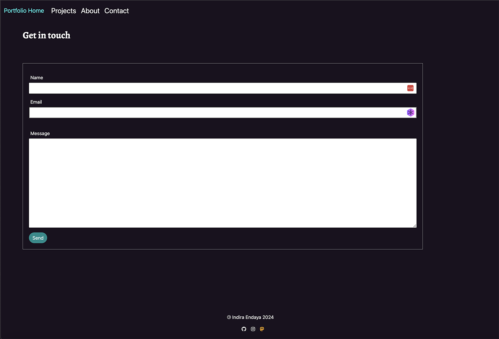

#  Codeswitch Studio React-folio

  
## Contents

1. [Description](#description) 
2. [Screenshots](#screenshots)
3. [Build](#build)
4. [Usage Information](#usage)
5. [License](#license)
6. [Contributing](#contributing)
7. [Acknowledgements](#acknowledgements)
8. [Questions](#questions)

---

## Description

A portfolio site built with React and the latest technologies. Deployed here at [GiHub pages](https://codeswitchstudio.github.io/react-folio).

---

**User Story** 

As a developer I want to generate a webpage that displays my portfolio so that a user gets quick access to my profile, my skills, my projects and be able to contac me for work.

---

## Screenshots

---

## Build

This application uses the following technologies:

 * [React Router](https://reactrouter.com/en/main)for the navigation 
 * [Vite](https://vitejs.dev/) development environment
 * [EmailJs](https://www.emailjs.com/docs/examples/reactjs/) for the contact form
 * Node.js - a JavaScript runtime environment that executes code outside of a web browser.
* NPM

---

## Usage

* Portfolio contains the following information for the user:
  * [ ] Developer name
  * [ ] Links to developer's:
    * [ ] GitHub Profile
    * [ ] LinkedIn Page
    * [ ] Email Address
    * [ ] Phone Number - (optional)
    * [ ] PDF version of Dev's resume containing up-to-date projects and professional experience
    * [ ] A list of projects (Challenges or Projects). For each project, make sure you have the following:
      * [ ] Project title
      * [ ] Link to the deployed version
      * [ ] Link to the GitHub repository
      * [ ] GIF or screenshot of the deployed application

---

## License

  This application is covered by the following license:

  MIT

---

## Contributing

To contribute to this application, please follow the steps found on the [GitHub guide](https://docs.github.com/en/get-started/exploring-projects-on-github/contributing-to-a-project)

---

## Acknowledgements

 - Thanks to our Instructor Laura Cole for the video on how to deploy react pages.
 - hero image photo by [Rishabh Dharmani on Unsplash](https://unsplash.com/photos/man-in-black-suit-jacket-raising-his-right-hand-IvfAs3Qk64M)
 - [Alexandre Sanlim's Badges for README.md-Profile](https://github.com/alexandresanlim/Badges4-README.md-Profile)
 - [Stack Overflow](https://stackoverflow.com/questions/64468843/netlify-deployment-failed-during-stage-building-site-build-script-returned-n)
 - [ChatGPT](https://chat.openai.com/)
 - [W3 Schools](https://www.w3schools.com/js/js_classes.asp)
 - [Alegreya Google Font ](https://fonts.google.com/specimen/Alegreya)
 - [Bootstrap](https://getbootstrap.com/)
 - [Font Awesome Icons](https://fontawesome.com/icons)

---

## Questions
  For any further questions please contact:
* GitHub Username: (codeswitchstudio)
* GitHub Email: (zxd2r73pm@relay.firefox.com)
  
  
